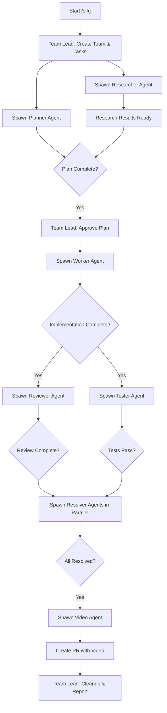

# feat: Add /slfg Swarm-Based Autonomous Engineering Workflow

## Overview

Create a new `/slfg` (Swarm LFG) command that transforms the existing sequential `/lfg` workflow into a fully autonomous, parallel swarm-based engineering pipeline. The swarm uses Claude's TeammateTool to spawn specialized teammates that work concurrently on different phases of the development lifecycle, with a team lead orchestrating the work.

**Key difference from `/lfg`:** Instead of running commands sequentially (plan → deepen → work → review → resolve → test → video), the swarm spawns specialized agents that work in parallel where possible, coordinate through task lists, and communicate via the TeammateTool messaging system.

## Problem Statement / Motivation

The current `/lfg` command runs phases sequentially:
1. `/workflows:plan` (blocking)
2. `/deepen-plan` (blocking)
3. `/workflows:work` (blocking)
4. `/workflows:review` (blocking)
5. `/resolve_todo_parallel` (parallel within phase, but phase is blocking)
6. `/test-browser` (blocking)
7. `/feature-video` (blocking)

This means:
- **Total time = sum of all phases** - no overlap
- **No concurrent research** - research agents in deepen-plan could run while planning continues
- **Sequential bottlenecks** - waiting on slow phases blocks everything
- **Single context** - one agent holds all context, risking context overflow

**The swarm approach:**
- **Parallel execution** - Multiple agents work simultaneously
- **Shared task list** - Coordination through structured tasks with dependencies
- **Specialized teammates** - Each agent focuses on their specialty
- **Autonomous operation** - Team lead orchestrates, teammates execute independently
- **Context distribution** - Each agent manages its own context

## Proposed Solution

### Architecture: Swarm-Based Engineering Team

```
┌─────────────────────────────────────────────────────────────────┐
│                        TEAM LEAD                                │
│  (Orchestrates, assigns tasks, approves plans, handles decisions)│
└─────────────────────────────────────────────────────────────────┘
                              │
          ┌───────────────────┼───────────────────┐
          ▼                   ▼                   ▼
    ┌──────────┐        ┌──────────┐        ┌──────────┐
    │ Planner  │        │Researcher│        │  Worker  │
    │ Agent    │        │  Agent   │        │  Agent   │
    └──────────┘        └──────────┘        └──────────┘
          │                   │                   │
          ▼                   ▼                   ▼
    ┌──────────┐        ┌──────────┐        ┌──────────┐
    │ Reviewer │        │  Tester  │        │  Video   │
    │  Agent   │        │  Agent   │        │  Agent   │
    └──────────┘        └──────────┘        └──────────┘
```

### Workflow Phases



### Agent Roles

| Agent | Role | Tools/Skills | Works With |
|-------|------|--------------|------------|
| **Team Lead** | Orchestrate, approve plans, handle decisions | TeammateTool, TaskList, AskUserQuestion | All agents |
| **Planner** | Create implementation plan | workflows:plan, AskUserQuestion | Researcher |
| **Researcher** | Deepen plan with research | deepen-plan, Context7, WebSearch | Planner |
| **Worker** | Implement the plan | Edit, Write, Bash, git | Team Lead |
| **Reviewer** | Review implementation | All review agents (kieran, dhh, security, etc.) | Worker |
| **Tester** | Run browser tests | agent-browser, test-browser skill | Worker |
| **Resolver** | Fix review findings | pr-comment-resolver pattern | Reviewer |
| **Video** | Record feature demo | feature-video skill | Worker |

### Coordination Mechanisms

#### 1. Task List (Shared Workspace)
```
~/.claude/tasks/{team-name}/
├── 001-pending-p1-create-plan.md
├── 002-pending-p1-research-best-practices.md
├── 003-blocked-p1-implement-feature.md  # blockedBy: [001, 002]
├── 004-blocked-p2-review-implementation.md  # blockedBy: [003]
├── 005-blocked-p2-run-browser-tests.md  # blockedBy: [003]
├── 006-blocked-p3-resolve-findings.md  # blockedBy: [004, 005]
└── 007-blocked-p3-record-video.md  # blockedBy: [006]
```

#### 2. Teammate Messaging
- **Team Lead → Teammate**: Task assignment, plan approval, shutdown requests
- **Teammate → Team Lead**: Idle notification, completion status, blockers
- **Teammate → Teammate**: Direct coordination when needed

#### 3. Plan Mode for Critical Phases
- **Planner Agent** uses `plan_mode_required: true`
- Team Lead receives plan approval requests
- Plan must be approved before Worker begins

## Technical Approach

### Phase 1: Command Setup

**File:** `plugins/compound-engineering/commands/slfg.md`

```markdown
---
name: slfg
description: Swarm-based autonomous engineering workflow
argument-hint: "[feature description]"
---

# Swarm LFG - Full Autonomous Engineering

## Step 1: Create Swarm Team

Use TeammateTool to create a new team:

\`\`\`
Teammate operation: spawnTeam
team_name: "slfg-{timestamp}"
description: "Autonomous engineering swarm for: {feature_description}"
\`\`\`

## Step 2: Create Task List

Use TaskCreate to create the full task dependency graph:

1. **Plan Feature** (P1, no dependencies)
   - Subject: "Create implementation plan"
   - Description: "Run /workflows:plan for: {feature_description}"

2. **Research & Deepen** (P1, no dependencies - runs parallel with planning)
   - Subject: "Research best practices"
   - Description: "Run /deepen-plan research agents"

3. **Implement Feature** (P1, blockedBy: [1, 2])
   - Subject: "Implement the approved plan"
   - Description: "Run /workflows:work on the plan file"

4. **Review Implementation** (P2, blockedBy: [3])
   - Subject: "Review code changes"
   - Description: "Run /workflows:review agents"

5. **Test in Browser** (P2, blockedBy: [3])
   - Subject: "Run browser tests"
   - Description: "Run /test-browser on affected pages"

6. **Resolve Findings** (P2, blockedBy: [4, 5])
   - Subject: "Fix review findings and test failures"
   - Description: "Run /resolve_todo_parallel"

7. **Record Video** (P3, blockedBy: [6])
   - Subject: "Record feature demo"
   - Description: "Run /feature-video for PR"

8. **Create PR** (P3, blockedBy: [7])
   - Subject: "Create pull request"
   - Description: "Push and create PR with video"

## Step 3: Spawn Teammates

Spawn teammates for parallel phases using Task tool:

\`\`\`
# Spawn Planner (with plan_mode_required)
Task general-purpose:
  team_name: "slfg-{timestamp}"
  name: "planner"
  mode: "plan"
  prompt: "You are the Planner. Claim task #1 (Create implementation plan).
           Run /workflows:plan for: {feature_description}
           When complete, use ExitPlanMode to request approval."

# Spawn Researcher (runs in parallel)
Task general-purpose:
  team_name: "slfg-{timestamp}"
  name: "researcher"
  prompt: "You are the Researcher. Claim task #2 (Research best practices).
           Research patterns, best practices, and documentation for: {feature_description}
           Write findings to docs/research/{feature}.md
           Mark task complete when done."
\`\`\`

## Step 4: Orchestration Loop

Team Lead monitors and orchestrates:

1. **Wait for Plan Approval Request**
   - Receive `plan_approval_request` message from Planner
   - Review the plan
   - Use `approvePlan` or `rejectPlan` with feedback

2. **Spawn Worker After Approval**
   - Once plan approved + research complete
   - Spawn Worker agent to implement

3. **Spawn Review + Test in Parallel**
   - Once implementation complete
   - Spawn Reviewer and Tester simultaneously

4. **Spawn Resolvers**
   - Once review + tests complete
   - Spawn resolver agents for each finding (parallel)

5. **Spawn Video Agent**
   - Once all findings resolved
   - Record and upload feature demo

6. **Create PR & Cleanup**
   - Create PR with video
   - Use `cleanup` operation to remove team resources
   - Report final status to user

## Step 5: Completion

Output summary:
- PR URL
- Time taken
- Agents spawned
- Tasks completed
```

### Phase 2: Teammate Agent Prompts

Each spawned teammate needs specific instructions:

#### Planner Agent
```markdown
You are the **Planner** for the slfg swarm.

Your job:
1. Read your assigned task using TaskGet
2. Run /workflows:plan for the feature
3. Use ExitPlanMode when plan is ready for approval
4. Wait for approval before marking task complete

You have plan_mode_required enabled. You MUST get approval before implementation begins.

When you finish or are blocked, send a message to the team lead.
```

#### Worker Agent
```markdown
You are the **Worker** for the slfg swarm.

Your job:
1. Read the approved plan file
2. Implement following /workflows:work patterns
3. Create incremental commits
4. Mark your task complete when implementation is done

Push to a feature branch, not main.
```

#### Reviewer Agent
```markdown
You are the **Reviewer** for the slfg swarm.

Your job:
1. Run all review agents in parallel against the changes
2. Create todos for each finding in todos/ directory
3. Synthesize findings
4. Mark your task complete

Do NOT fix the issues - just document them for the Resolver agents.
```

### Phase 3: Error Handling & Recovery

| Scenario | Handling |
|----------|----------|
| Teammate fails | Team Lead receives error, can respawn or handle manually |
| Plan rejected | Planner revises and resubmits |
| Tests fail | Create P1 todos, spawn resolvers to fix |
| Context overflow | Checkpoint/resume with fresh context |
| User interrupt | Cleanup team, preserve work |

### Phase 4: Progress Visibility

The team lead maintains visibility:

```markdown
## Swarm Status: slfg-20260125-123456

**Feature:** Add user authentication

| Task | Status | Agent | Progress |
|------|--------|-------|----------|
| Create plan | Complete | planner | 100% |
| Research | Complete | researcher | 100% |
| Implement | In Progress | worker | 60% |
| Review | Pending | - | - |
| Test | Pending | - | - |
| Resolve | Pending | - | - |
| Video | Pending | - | - |

**Active Agents:** 1 (worker)
**Messages:** 12 received
**Elapsed:** 4m 32s
```

## Acceptance Criteria

### Functional Requirements
- [ ] `/slfg` command creates a team and task list
- [ ] Planner and Researcher run in parallel at start
- [ ] Plan requires team lead approval before implementation
- [ ] Worker implements after plan approval
- [ ] Reviewer and Tester run in parallel after implementation
- [ ] Resolver agents fix findings in parallel
- [ ] Video agent records demo
- [ ] PR created with all artifacts
- [ ] Team resources cleaned up on completion

### Non-Functional Requirements
- [ ] Faster than sequential `/lfg` for multi-phase workflows
- [ ] Graceful handling of agent failures
- [ ] Progress visible to user throughout
- [ ] Context distributed across agents (no single-agent overflow)
- [ ] Works with existing commands/skills (composition)

### Quality Gates
- [ ] All spawned agents complete their tasks
- [ ] No orphaned team resources after completion
- [ ] Plan approval gate enforced
- [ ] Final PR includes video and proper description

## Dependencies & Prerequisites

1. **TeammateTool** - Already available in Claude Code
2. **Task tools** (TaskCreate, TaskUpdate, TaskList, TaskGet) - Already available
3. **Existing commands** - /workflows:plan, /workflows:work, etc.
4. **Agent spawning** - Task tool with team_name and name parameters

## Risk Analysis & Mitigation

| Risk | Likelihood | Impact | Mitigation |
|------|------------|--------|------------|
| Agent coordination failures | Medium | High | Explicit task dependencies, team lead oversight |
| Context overflow in team lead | Medium | Medium | Delegate work, keep lead context light |
| Deadlock from circular dependencies | Low | High | Linear task dependency graph |
| Orphaned agents | Medium | Low | Shutdown requests, timeout cleanup |
| Plan approval bottleneck | Medium | Medium | Clear approval criteria, fast feedback |

## Implementation Phases

### MVP (Phase 1)
- [ ] Create `/slfg` command with basic team creation
- [ ] Implement task list creation with dependencies
- [ ] Spawn Planner + Researcher in parallel
- [ ] Plan approval flow with team lead
- [ ] Spawn Worker after approval
- [ ] Basic completion and cleanup

### Enhanced (Phase 2)
- [ ] Parallel Reviewer + Tester spawning
- [ ] Dynamic Resolver agent spawning
- [ ] Video agent integration
- [ ] Progress dashboard output
- [ ] Error recovery and retry

### Polished (Phase 3)
- [ ] Checkpoint/resume for interrupted swarms
- [ ] Cost tracking per agent
- [ ] Performance metrics (time savings vs /lfg)
- [ ] User configuration options

## Files to Create/Modify

| File | Action | Description |
|------|--------|-------------|
| `commands/slfg.md` | Create | Main swarm command |
| `skills/swarm-engineering/SKILL.md` | Create | Skill with teammate prompts |
| `README.md` | Update | Add /slfg to command list |
| `CHANGELOG.md` | Update | Document new feature |
| `.claude-plugin/plugin.json` | Update | Bump version, update counts |

## References & Research

### Internal References
- `/lfg` command: `plugins/compound-engineering/commands/lfg.md`
- Agent-native architecture: `plugins/compound-engineering/skills/agent-native-architecture/SKILL.md`
- Execution patterns: `plugins/compound-engineering/skills/agent-native-architecture/references/agent-execution-patterns.md`
- Parallel resolution: `plugins/compound-engineering/commands/resolve_parallel.md`

### TeammateTool Operations
From system prompt:
- `spawnTeam` - Create a new team
- `write` - Send message to ONE teammate
- `broadcast` - Send to ALL teammates (use sparingly)
- `approvePlan` / `rejectPlan` - Handle plan approval requests
- `requestShutdown` / `approveShutdown` - Graceful shutdown
- `cleanup` - Remove team and task directories

### Task Tool Integration
- `team_name` parameter to join spawned agents to team
- `name` parameter to give agents identifiable names
- `mode: "plan"` for plan_mode_required behavior

## Alternative Approaches Considered

### Alternative 1: Enhanced Sequential (Rejected)
Keep `/lfg` sequential but add more parallelism within phases.
- **Rejected because:** Doesn't leverage full swarm capabilities, still fundamentally sequential.

### Alternative 2: Background Agents Only (Rejected)
Use `run_in_background` instead of teams for parallelism.
- **Rejected because:** No coordination mechanism, no shared task list, harder to monitor.

### Alternative 3: Hybrid Sequential/Parallel (Considered)
Some phases sequential (plan→implement), some parallel (review+test).
- **This is actually what we're proposing** - Respects natural dependencies while maximizing parallelism.

## Success Metrics

1. **Time to PR** - Should be faster than sequential `/lfg` for non-trivial features
2. **Context efficiency** - No single agent exceeds context limits
3. **Completion rate** - High percentage of swarms complete successfully
4. **User satisfaction** - Clear progress visibility, fewer interruptions

---

**Next Steps:**
1. Review and approve this plan
2. Implement MVP (Phase 1)
3. Test with a real feature implementation
4. Iterate based on learnings
